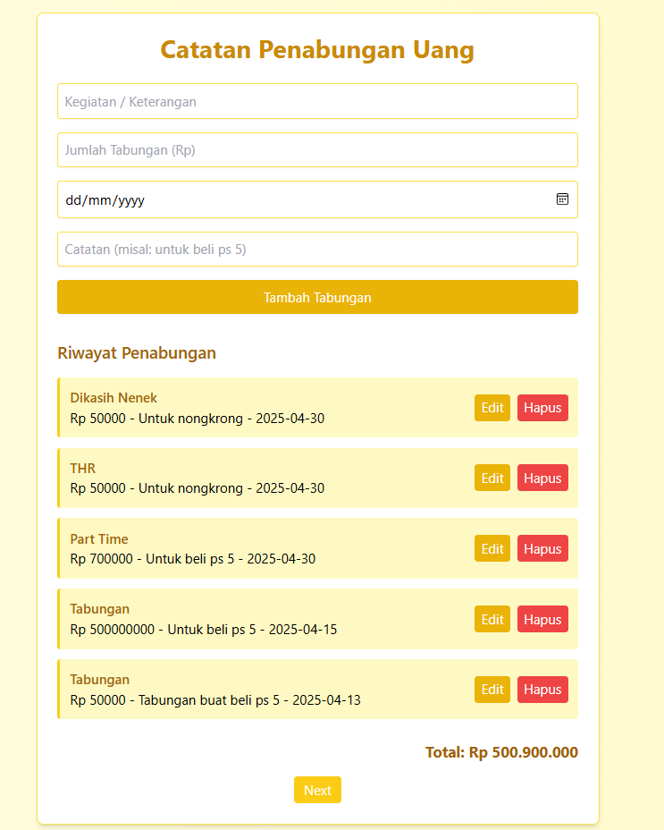

# 💰 Aplikasi Catatan Penabungan Uang

Aplikasi personal dashboard sederhana yang memungkinkan pengguna mencatat aktivitas tabungan harian secara interaktif.  
Pengguna dapat menambahkan, mengedit, dan menghapus data tabungan, lalu menyimpannya ke **localStorage** agar data tidak hilang saat browser ditutup.

---

## ✨ Fitur Aplikasi

- ✅ Tambah data penabungan
- ✅ Edit data yang sudah ditambahkan
- ✅ Hapus data tabungan
- ✅ Total tabungan ditampilkan otomatis
- ✅ Data disimpan ke `localStorage` (persisten)
- ✅ Navigasi dengan **paginasi** (5 entry per halaman)
- ✅ Desain responsif dengan nuansa **kuning cerah**
- ✅ User-friendly dan ringan dijalankan

---

⚙️ Fitur ES6+ yang Diimplementasikan
Fitur ES6+	Implementasi di Aplikasi
let & const	Digunakan untuk semua deklarasi variabel
Arrow Function	✅ render, renderPagination, updateTotal, dll
Template Literals	Digunakan untuk .innerHTML saat render list tabungan
Async/Await	Dipakai saat simpan data edit agar simulasi asinkron
Class	class Tabungan untuk struktur data tabungan
Modules (import/export)	Pisah file: main.js dan app.js via ES6 module syntax
Array Methods	forEach, reduce, find, filter, slice, reverse

---

## 📸 Screenshot Aplikasi

